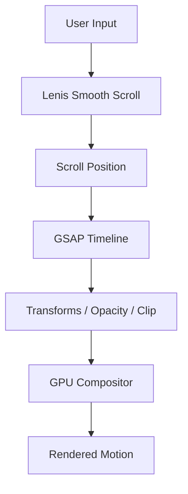
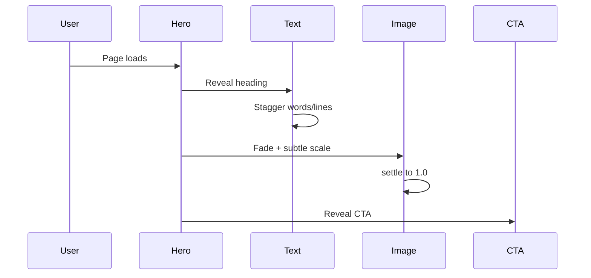
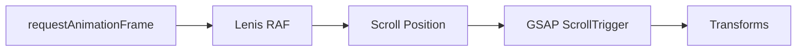
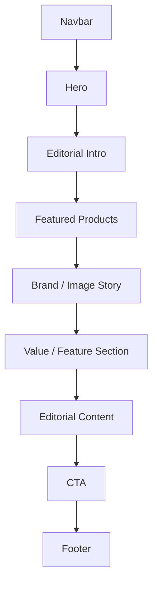
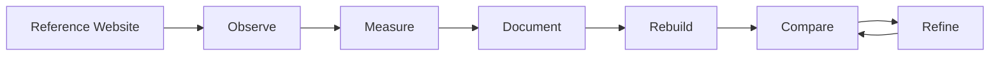

# KANVA — WEBSITE CLONE / REVERSE-ENGINEERING MASTER SPECIFICATION

> **Purpose:** Production-grade specification for rebuilding the Kanva Framer e-commerce website with the same visual language, information architecture, responsive behavior, interactions, motion principles, and perceived animation quality.
>
> **Reference:** `https://kanva-template.framer.website/`
>
> **Important:** This document separates observed implementation evidence from implementation recommendations. The goal is visual/behavioral fidelity, not copying Framer's internal runtime.

---

# 01 — PROJECT OBJECTIVE

## Primary Goal

Recreate the Kanva website as a modern, maintainable frontend while preserving:

- overall visual identity
- page hierarchy
- spacing rhythm
- typography hierarchy
- color system
- component proportions
- image treatment
- navigation behavior
- hover states
- scroll behavior
- reveal animations
- route transitions
- modal behavior
- commerce interactions
- responsive behavior
- perceived performance
- accessibility behavior
- reduced-motion behavior

The result must **look and feel like the reference**, while using a clean component architecture rather than reproducing Framer's generated bundle structure.

## Quality Target

The clone should be evaluated in this order:

1. Visual fidelity
2. Motion fidelity
3. Responsive fidelity
4. Interaction fidelity
5. Typography fidelity
6. Performance
7. Accessibility
8. Code maintainability

---

# 02 — REFERENCE PROJECT ANALYSIS

## Project Identity

Kanva is an editorial/luxury skincare e-commerce template.

Its visual direction combines:

- premium skincare branding
- editorial typography
- warm organic neutrals
- large product photography
- generous but controlled whitespace
- rounded/soft containers
- restrained UI chrome
- subtle motion
- smooth scrolling
- micro-interactions

The design should feel:

> calm + premium + editorial + tactile + modern

It should **not** feel:

- dashboard-like
- SaaS-like
- overly animated
- neon
- generic Tailwind
- template-generated
- excessively glassmorphic
- crowded

---

# 03 — ORIGINAL RUNTIME ARCHITECTURE

The supplied project audit indicates a Framer-generated architecture containing:

```text
Framer Runtime
    |
    +-- React runtime
    |
    +-- Motion runtime
    |
    +-- Framer router
    |
    +-- CMS collections
    |
    +-- Commerce layer
    |
    +-- Lenis smooth scrolling
    |
    +-- Phosphor icons
    |
    +-- Font assets
    |
    +-- image/media assets
```

Observed project resources include:

```text
kanva_template.framer.website/
├── index.html
├── server.js
├── package.json
│
├── framerusercontent.com/
│   ├── sites/
│   ├── modules/
│   ├── images/
│   ├── assets/
│   ├── cms/
│   └── third-party-assets/
│
├── fonts.gstatic.com/
├── app.framerstatic.com/
├── framer.com/
├── unpkg.com/
├── api.iconify.design/
└── _DataURI/
```

### Important

Do **not** reproduce this directory structure in the new application.

Instead translate it into a clean application architecture.

---

# 04 — RECOMMENDED CLONE STACK

## Frontend

```text
React 19
TypeScript
Vite
Tailwind CSS
GSAP
Lenis
React Router
Lucide React OR Phosphor Icons
```

Optional:

```text
@gsap/react
SplitType
Lenis
Zustand
React Query
```

Do not introduce libraries merely because they are popular.

Every dependency must solve a real requirement.

---

# 05 — TARGET APPLICATION ARCHITECTURE

```text
src/
│
├── app/
│   ├── router.tsx
│   └── providers.tsx
│
├── components/
│   ├── layout/
│   │   ├── Navbar.tsx
│   │   ├── Footer.tsx
│   │   └── PageShell.tsx
│   │
│   ├── navigation/
│   │   ├── DesktopNav.tsx
│   │   ├── MobileNav.tsx
│   │   ├── SearchButton.tsx
│   │   ├── CartButton.tsx
│   │   └── LocaleButton.tsx
│   │
│   ├── motion/
│   │   ├── Reveal.tsx
│   │   ├── Stagger.tsx
│   │   ├── Magnetic.tsx
│   │   ├── PageTransition.tsx
│   │   └── Parallax.tsx
│   │
│   ├── product/
│   │   ├── ProductCard.tsx
│   │   ├── ProductGrid.tsx
│   │   ├── ProductMedia.tsx
│   │   ├── ProductPrice.tsx
│   │   └── ProductBadge.tsx
│   │
│   ├── commerce/
│   │   ├── CartDrawer.tsx
│   │   ├── Checkout.tsx
│   │   └── CurrencySelector.tsx
│   │
│   └── ui/
│       ├── Button.tsx
│       ├── Pill.tsx
│       ├── IconButton.tsx
│       ├── Divider.tsx
│       └── Modal.tsx
│
├── pages/
│   ├── Home.tsx
│   ├── About.tsx
│   ├── Shop.tsx
│   ├── Product.tsx
│   ├── Blog.tsx
│   ├── BlogPost.tsx
│   ├── FAQ.tsx
│   ├── Contact.tsx
│   ├── Search.tsx
│   ├── Favorites.tsx
│   ├── Licensing.tsx
│   └── Terms.tsx
│
├── data/
│   ├── products.ts
│   ├── categories.ts
│   ├── blog.ts
│   └── faq.ts
│
├── hooks/
│   ├── useLenis.ts
│   ├── useMediaQuery.ts
│   ├── useScrollProgress.ts
│   └── useReducedMotion.ts
│
├── lib/
│   ├── motion.ts
│   ├── format.ts
│   └── utils.ts
│
├── styles/
│   ├── tokens.css
│   ├── typography.css
│   └── motion.css
│
└── main.tsx
```

---

# 06 — DESIGN SYSTEM

## 6.1 Color Tokens

Observed palette:

| Token | Value | Purpose |
|---|---|---|
| Primary dark | `#1a1c18` | headings, primary text, dark controls |
| Muted text | `rgba(26,28,24,.60)` | descriptions, secondary copy |
| Subtle border | `rgba(26,28,24,.30)` | dividers, outlines |
| White | `#ffffff` | inverse surfaces |
| Canvas | `#f2f2ef` | primary page background |
| Surface | `#e8e8e1` | soft cards/pills |
| Deep olive | `#3c4433` | secondary accents |
| Sage | `#757d5c` | highlights and badges |
| Border | `#dbdbd1` | container outlines |

### CSS variables

```css
:root {
  --color-bg: #f2f2ef;
  --color-surface: #e8e8e1;
  --color-text: #1a1c18;
  --color-text-muted: rgba(26, 28, 24, 0.6);
  --color-border: rgba(26, 28, 24, 0.3);
  --color-border-soft: #dbdbd1;
  --color-white: #ffffff;
  --color-olive: #3c4433;
  --color-sage: #757d5c;
}
```

Do not randomly introduce additional colors.

---

# 07 — TYPOGRAPHY SYSTEM

## Font Roles

The audit identifies the following typography families:

### Sentient

Role:

- hero headings
- editorial statements
- large campaign typography
- premium section titles

Characteristics:

- serif
- high contrast
- elegant
- fashion/editorial feel

### DM Sans

Role:

- navigation
- UI labels
- card headings
- utility text

Characteristics:

- clean
- geometric
- compact
- highly legible

### Geist

Role:

- prices
- controls
- small metadata
- technical/UI information

### Figtree

Role:

- body copy
- FAQ text
- descriptions

### Inter

Role:

- fallback only

---

# 08 — TYPOGRAPHY SCALE

Use fluid typography rather than fixed desktop-only sizes.

Recommended baseline:

```css
--text-xs: 0.6875rem;
--text-sm: 0.8125rem;
--text-md: 0.9375rem;
--text-lg: 1.125rem;

--display-sm: clamp(2.5rem, 5vw, 5rem);
--display-md: clamp(3.5rem, 7vw, 7rem);
--display-lg: clamp(4rem, 10vw, 10rem);
```

Hero typography must be adjusted from screenshots/runtime observation rather than blindly using these values.

---

# 09 — GRID SYSTEM

Use a flexible editorial grid.

Desktop:

```text
12-column conceptual grid
|
+-- outer margin
+-- content grid
+-- image spans
+-- text spans
+-- CTA spans
```

Recommended starting values:

```css
--page-padding-desktop: 32px;
--page-padding-tablet: 24px;
--page-padding-mobile: 16px;
--grid-gap: 16px;
```

The exact values should be tuned against reference screenshots.

---

# 10 — RESPONSIVE BREAKPOINTS

Reference behavior indicates three primary layout states:

| Device | Width |
|---|---|
| Mobile | `< 810px` |
| Tablet | `810px – 1279px` |
| Desktop | `>= 1280px` |

Do not simply scale desktop down.

Each breakpoint must have intentional composition.

---

# 11 — GLOBAL LAYOUT RULES

## Page

```text
Viewport
  |
  +-- fixed/sticky navigation
  |
  +-- main content
  |
  +-- footer
```

Use:

```css
html {
  background: var(--color-bg);
}

body {
  margin: 0;
  background: var(--color-bg);
  color: var(--color-text);
}
```

Avoid:

- accidental horizontal overflow
- layout shifts
- image stretching
- excessive container nesting
- inconsistent page gutters

---

# 12 — NAVIGATION SYSTEM

## Desktop Navigation

The navigation should remain minimal.

Expected conceptual structure:

```text
[Brand]       [Navigation Links]       [Search] [Account/Favorites] [Cart]
```

Characteristics:

- compact height
- clean typography
- low visual noise
- high whitespace
- subtle hover behavior
- iconography with thin strokes

### Hover

Do not use aggressive scaling.

Preferred:

```text
text color transition
+
small underline / directional movement
+
subtle opacity transition
```

---

# 13 — MOBILE NAVIGATION

Mobile should transform into a dedicated interaction model.

Concept:

```text
[Logo] ---------------- [Menu]
                           |
                           v
                  Full / near-full screen
                  navigation panel
```

Animation:

```text
menu button
    ↓
overlay fade
    +
navigation panel clip/reveal
    +
staggered link entrance
```

Recommended timing:

```text
overlay: 0.35s
panel: 0.45–0.60s
links: 0.04–0.08s stagger
```

Use `ease-out` for the primary reveal.

---

# 14 — LENIS SMOOTH SCROLL

The audit identifies Lenis 1.3.x.

The reference behavior is based on smooth inertial scrolling.

Conceptual configuration:

```js
const lenis = new Lenis({
  smoothWheel: true,
  lerp: 0.1,
  syncTouch: false,
  syncTouchLerp: 0.075,
  touchInertiaExponent: 1.7
});
```

Integrate Lenis with the animation ticker.

```text
requestAnimationFrame
        |
        v
      Lenis
        |
        v
      GSAP
        |
        v
 DOM transforms
```

Do not run multiple independent animation loops.

---

# 15 — MOTION PHILOSOPHY

The motion language is:

```text
slow
soft
controlled
physical
editorial
```

Animation must communicate hierarchy.

Do not animate everything.

Priority:

1. page transition
2. hero entrance
3. section reveal
4. product image movement
5. hover interaction
6. navigation micro-interaction
7. modal entrance

---

# 16 — MOTION ARCHITECTURE



Motion layers:

```text
Layer 1
Smooth scrolling

Layer 2
Scroll-driven animation

Layer 3
Component entrance

Layer 4
Hover/tap micro-interaction

Layer 5
Route transition

Layer 6
Modal/drawer transition
```

---

# 17 — ANIMATION TOKENS

Create centralized tokens:

```ts
export const motion = {
  fast: 0.2,
  normal: 0.4,
  medium: 0.6,
  slow: 0.9,

  easeOut: "power3.out",
  easeSoft: "power2.out",
  easeInOut: "power2.inOut",
};
```

Never scatter arbitrary durations throughout components.

---

# 18 — PAGE LOAD ANIMATION

Initial load should feel intentional.

Recommended sequence:

```text
0.00s
page background visible

0.10s
navigation begins

0.20s
hero label

0.25s
hero title

0.35s
hero supporting copy

0.45s
hero imagery

0.55s+
secondary elements
```

Use staggered opacity + translate.

Recommended:

```text
opacity: 0 → 1
y: 24px → 0
```

Do not use huge vertical translations.

---

# 19 — HERO ANIMATION

Hero should be the strongest motion moment.

Potential sequence:



Recommended image behavior:

```text
initial scale: 1.04–1.08
final scale: 1.00
opacity: 0 → 1
```

Avoid obvious zoom effects.

---

# 20 — TEXT REVEAL

For editorial headings, prefer line-based or word-based reveals.

Concept:

```text
Hidden:
opacity: 0
y: 20–30px

Visible:
opacity: 1
y: 0
```

Recommended stagger:

```text
0.03s – 0.07s
```

Do not animate every individual character unless the reference clearly does so.

---

# 21 — SCROLL REVEALS

Default reveal:

```js
gsap.fromTo(
  element,
  { y: 24, opacity: 0 },
  {
    y: 0,
    opacity: 1,
    duration: 0.7,
    ease: "power3.out",
    scrollTrigger: {
      trigger: element,
      start: "top 82%"
    }
  }
);
```

Use once per section.

Avoid repetitive animation on every paragraph.

---

# 22 — STAGGERED CARD REVEALS

For product/feature grids:

```text
Card 1
0.00s

Card 2
0.06s

Card 3
0.12s

Card 4
0.18s
```

Animation:

```text
opacity 0 → 1
y 24 → 0
```

Optional subtle scale:

```text
0.98 → 1
```

Do not combine:

```text
large scale
rotation
blur
bounce
parallax
```

at the same time.

---

# 23 — PRODUCT CARD INTERACTION

Product cards are a major interaction surface.

On hover:

```text
image
    scale 1.02–1.04

content
    slight translateY

arrow
    translateX 3–6px

secondary layer
    opacity transition
```

Recommended duration:

```text
0.35–0.50s
```

Recommended easing:

```text
power2.out / power3.out
```

---

# 24 — PRODUCT IMAGE BEHAVIOR

Images must preserve aspect ratio.

Use:

```css
img {
  display: block;
  width: 100%;
  height: 100%;
  object-fit: cover;
}
```

For transparent product cutouts:

```text
object-fit: contain
```

The reference uses strong image composition, therefore image cropping must be treated as part of the design system.

Never replace reference imagery with generic stock images during fidelity testing.

---

# 25 — IMAGE LOADING

Prevent layout shift.

Every image should have:

```text
known aspect ratio
+
reserved space
+
lazy loading when below fold
+
priority loading for hero
```

Use:

```html

```

Hero images should use high priority.

---

# 26 — PARALLAX

Parallax should be subtle.

Recommended range:

```text
image movement:
10px–50px
```

Do not use exaggerated 200px movement.

Concept:

```text
scroll progress
      |
      v
image yPercent
      |
      v
subtle depth
```

Use GSAP ScrollTrigger.

---

# 27 — PAGE TRANSITIONS

The reference audit indicates a directional route transition/wipe.

Recommended implementation:

```text
Current Page
      |
      v
overlay / clip-path
      |
      v
new route
```

Suggested:

```text
duration: 0.4s
ease: cubic-bezier(.27,0,.51,1)
```

The transition should be:

- fast enough not to delay navigation
- visually intentional
- consistent on all routes

Never trap users behind long transitions.

---

# 28 — MODAL SYSTEM

Modal types include:

- country/currency selector
- search
- cart
- mobile navigation

Animation:

```text
Backdrop:
opacity 0 → 1

Dialog:
opacity 0 → 1
y 20px → 0
```

Use:

```text
duration: ~0.30s
ease: ease-out
```

On close:

```text
reverse animation
```

Lock page scroll while modal is open.

Restore focus to the triggering element.

---

# 29 — SEARCH DRAWER

Search should feel like an extension of the navigation.

Structure:

```text
Search Overlay
|
+-- search input
+-- suggestions/results
+-- close control
```

Motion:

```text
overlay fade
+
content slide/reveal
```

Do not make search feel like a separate application.

---

# 30 — CART DRAWER

Structure:

```text
Cart
|
+-- product thumbnail
+-- title
+-- quantity
+-- price
+-- remove
|
+-- subtotal
+-- checkout CTA
```

Motion:

```text
backdrop fade
drawer translateX
```

Recommended:

```text
drawer duration: 0.45–0.60s
```

Use transform-based animation.

---

# 31 — BUTTON SYSTEM

Primary button characteristics:

- compact
- rounded/pill or softly rounded
- dark fill
- light text
- minimal shadow
- strong hover state

Hover:

```text
background transition
text transition
arrow movement
```

Avoid:

- excessive shadows
- gradient buttons
- huge scale
- elastic bounce

---

# 32 — BADGES / PILLS

Badge design:

```text
small typography
+
soft background
+
rounded shape
+
tight horizontal padding
```

Possible inversion behavior:

```text
light background → dark background
dark text → white text
```

Use a smooth transition.

---

# 33 — ICON SYSTEM

The audit indicates Phosphor icons.

Preferred icon characteristics:

- thin
- editorial
- geometric
- consistent stroke weight

Core icons:

```text
ArrowRight
ShoppingBag
Heart
MagnifyingGlass
User
InstagramLogo
X / Close
Menu
```

Do not mix icon families randomly.

---

# 34 — SECTION ARCHITECTURE

Every page should be composed from semantic sections.

Example:

```text
Page
|
+-- Navigation
|
+-- Hero
|
+-- Intro statement
|
+-- Product/value section
|
+-- Editorial image section
|
+-- Product grid
|
+-- Brand story
|
+-- CTA
|
+-- Footer
```

Each section must have:

- clear visual purpose
- consistent gutter
- deliberate vertical rhythm
- one primary hierarchy
- controlled motion

---

# 35 — PRODUCT GRID

Desktop:

```text
4 columns
```

Tablet:

```text
2 columns
```

Mobile:

```text
1 column
```

Grid must not simply shrink.

Product cards should preserve:

```text
image ratio
+
title
+
metadata
+
price
+
interaction area
```

---

# 36 — CMS DATA MODEL

Product:

```ts
type Product = {
  id: string;
  title: string;
  slug: string;
  category: string;
  price: number;
  compareAtPrice?: number;
  images: string[];
  description: string;
  ingredients?: string[];
  faq?: FAQ[];
};
```

Category:

```ts
type Category = {
  id: string;
  title: string;
  slug: string;
};
```

Blog:

```ts
type BlogPost = {
  id: string;
  title: string;
  slug: string;
  excerpt: string;
  image: string;
  content: string;
  category: string;
};
```

---

# 37 — ROUTING MAP

Reference route architecture identified in the audit:

```text
/
├── /about
├── /faq
├── /contact
├── /terms
├── /licensing
│
├── /shop
│   ├── /shop/:slug
│   └── /shop/category/:category
│
├── /blog
│   ├── /blog/:slug
│   └── /blog/category/:category
│
├── /search
└── /favorites
```

Implement route transitions globally.

---

# 38 — FOOTER

Footer should act as the final editorial block.

Structure:

```text
Large brand statement
|
+-- navigation
+-- social
+-- legal
+-- locale/currency
|
+-- copyright
```

Use typography hierarchy rather than many UI boxes.

Footer animation:

```text
reveal
+
subtle text movement
+
image/brand transition if applicable
```

---

# 39 — RESPONSIVE BEHAVIOR

## Desktop

Priorities:

```text
large editorial typography
4-column product grids
horizontal navigation
large imagery
wide compositions
```

## Tablet

Priorities:

```text
2-column layouts
reduced typography
compressed gutters
simplified navigation
```

## Mobile

Priorities:

```text
single column
large touch targets
compact navigation
reduced motion
shorter text blocks
full-width media
```

---

# 40 — MOBILE MOTION

Mobile should use less motion than desktop.

Reduce:

- parallax amplitude
- complex text splitting
- hover-only interactions
- excessive simultaneous transitions

Keep:

- page reveal
- navigation reveal
- card entrance
- modal transitions

---

# 41 — ACCESSIBILITY

Required:

```text
keyboard navigation
visible focus
semantic buttons
semantic links
ARIA only when needed
alt text
proper heading order
dialog focus management
Escape-to-close
reduced-motion support
```

---

# 42 — REDUCED MOTION

Respect:

```css
@media (prefers-reduced-motion: reduce) {
  * {
    animation-duration: 0.01ms !important;
    animation-iteration-count: 1 !important;
    scroll-behavior: auto !important;
    transition-duration: 0.01ms !important;
  }
}
```

For GSAP, explicitly disable or simplify ScrollTrigger/parallax when reduced motion is enabled.

---

# 43 — PERFORMANCE

Target:

```text
LCP: excellent
CLS: ~0
INP: excellent
60fps motion
minimal main-thread work
```

Rules:

- animate `transform` and `opacity`
- avoid layout-triggering animation
- reserve image dimensions
- lazy load below-fold assets
- compress images
- use WebP/AVIF where appropriate
- preload critical fonts only
- avoid excessive JS
- avoid duplicate animation loops

---

# 44 — GPU ANIMATION RULE

Prefer:

```text
transform
opacity
clip-path
```

Avoid continuous animation of:

```text
top
left
width
height
margin
padding
```

unless unavoidable.

---

# 45 — GSAP ARCHITECTURE

Create a central motion layer.

Example:

```ts
export const reveal = (
  element: Element,
  options = {}
) => {
  gsap.fromTo(
    element,
    {
      y: 24,
      opacity: 0,
    },
    {
      y: 0,
      opacity: 1,
      duration: 0.7,
      ease: "power3.out",
      ...options,
    }
  );
};
```

Components should call motion utilities instead of duplicating animation logic.

---

# 46 — SCROLLTRIGGER ARCHITECTURE

Every ScrollTrigger must be:

- scoped
- cleaned up
- responsive
- reduced-motion aware

React pattern:

```text
component mount
      |
      v
GSAP context
      |
      v
create animation
      |
      v
component unmount
      |
      v
context.revert()
```

This prevents stale animations.

---

# 47 — LENIS + GSAP INTEGRATION

Use one synchronized loop:



Do not create independent RAF loops in every component.

---

# 48 — INTERACTION STATE MATRIX

| Component | Idle | Hover | Active | Focus |
|---|---|---|---|---|
| Nav link | normal | color/underline shift | darker | visible ring |
| CTA | dark | subtle inversion | pressed | visible ring |
| Product card | static | image scale | pressed | outline |
| Cart | icon | slight movement | drawer | focus |
| Search | icon | opacity shift | overlay | input focus |
| Badge | light | inversion | pressed | outline |

---

# 49 — DESIGN DETAILS THAT MUST NOT BE LOST

During implementation, explicitly preserve:

- off-white background
- olive/charcoal text
- serif editorial hero typography
- clean sans-serif UI typography
- restrained border treatment
- soft rounded controls
- premium product photography
- large image areas
- generous but purposeful whitespace
- compact navigation
- smooth scroll
- subtle card motion
- staggered entrances
- directional route transitions
- modal blur/overlay behavior
- responsive product grids

---

# 50 — WHAT NOT TO DO

Do not:

```text
❌ convert the design into a generic Tailwind template
❌ use random gradients
❌ use excessive glassmorphism
❌ use neon accent colors
❌ use giant shadows
❌ add floating blobs
❌ animate every element
❌ use bounce everywhere
❌ replace editorial serif typography with Inter
❌ use arbitrary stock imagery
❌ introduce excessive rounded cards
❌ create dashboard-style UI
❌ use multiple unrelated icon sets
❌ add unnecessary dependencies
❌ reproduce Framer's compiled bundle structure
```

---

# 51 — VISUAL FIDELITY WORKFLOW

Implementation must follow this order.

## Phase 1 — Asset inventory

Collect:

```text
fonts
images
SVGs
icons
logos
videos
backgrounds
```

Create:

```text
src/assets/
```

## Phase 2 — Screenshot baseline

Capture reference at:

```text
1440 × 900
1280 × 800
1024 × 768
810 × 1080
768 × 1024
390 × 844
375 × 812
```

## Phase 3 — Layout reconstruction

Match:

```text
container width
gutter
grid
section heights
image ratios
typography
```

## Phase 4 — Motion

Only after static fidelity is close.

## Phase 5 — Interaction

Add:

```text
hover
tap
drawer
modal
search
cart
navigation
```

## Phase 6 — Performance

Run:

```text
Lighthouse
Chrome Performance
mobile throttling
```

---

# 52 — REVERSE-ENGINEERING CHECKLIST

For every reference page record:

```text
[ ] URL
[ ] viewport dimensions
[ ] background
[ ] content max-width
[ ] horizontal padding
[ ] section height
[ ] heading font
[ ] heading size
[ ] heading line-height
[ ] body font
[ ] body size
[ ] button size
[ ] border radius
[ ] border color
[ ] image ratio
[ ] image object position
[ ] hover behavior
[ ] scroll behavior
[ ] entrance animation
[ ] stagger amount
[ ] animation duration
[ ] easing
[ ] route transition
[ ] mobile behavior
[ ] tablet behavior
[ ] keyboard behavior
```

---

# 53 — COMPONENT AUDIT

Expected reusable components:

```text
Navbar
Footer
Logo
NavLink
Button
IconButton
Pill
Badge
ProductCard
ProductGrid
ProductMedia
Price
SectionHeading
EditorialText
ImageBlock
Reveal
Stagger
Parallax
PageTransition
Modal
Drawer
SearchDrawer
CartDrawer
LocaleModal
MobileMenu
```

Avoid creating components merely for tiny fragments that have no reuse or semantic purpose.

---

# 54 — PAGE IMPLEMENTATION ORDER

Recommended order:

```text
1. Global tokens
2. Typography
3. Layout shell
4. Navbar
5. Footer
6. Button/icon primitives
7. Motion utilities
8. Home
9. Shop
10. Product detail
11. About
12. Blog
13. FAQ
14. Contact
15. Search
16. Favorites
17. Commerce drawers/modals
18. Route transitions
19. Mobile optimization
20. Performance
```

---

# 55 — HOME PAGE COMPOSITION

The home page must establish the complete visual language.

Conceptual structure:



Hero gets the strongest visual hierarchy.

---

# 56 — SHOP PAGE

Structure:

```text
Header
|
+-- page title
+-- category/filter controls
|
+-- product grid
|
+-- pagination/load more
|
+-- footer
```

Filters should animate subtly.

Product cards should enter progressively.

---

# 57 — PRODUCT DETAIL

Structure:

```text
Product media
        +
Product information
        |
        +-- title
        +-- price
        +-- description
        +-- options
        +-- quantity
        +-- add to cart
        |
        +-- ingredients
        +-- FAQ
```

Desktop may use a split composition.

Mobile should stack media above product information.

---

# 58 — BLOG

Editorial composition:

```text
Large title
|
Featured article
|
Article grid/list
|
Categories
```

Avoid conventional blog-card-heavy SaaS layouts.

Typography and imagery should dominate.

---

# 59 — FAQ

Use an accordion.

Closed:

```text
question
+
arrow
```

Open:

```text
question
+
content
+
rotated arrow
```

Animation:

```text
height
opacity
```

For accessibility, use real buttons and controlled regions.

---

# 60 — DATA / COMMERCE STATE

Separate UI from commerce.

```text
UI
 |
 v
Cart Store
 |
 v
Commerce Adapter
 |
 v
Shopify / API
```

This allows the visual clone to run with mock data during development.

---

# 61 — MOCK DATA MODE

Development must work without a live Shopify backend.

Use:

```text
mock products
mock categories
mock blog posts
mock FAQs
mock cart
```

The frontend should remain fully testable.

---

# 62 — ERROR / LOADING STATES

Use elegant states matching the brand.

Loading:

```text
skeleton
+
soft neutral surface
```

Avoid:

```text
spinner everywhere
```

Error:

```text
short explanation
+
retry CTA
```

---

# 63 — SEO

Each route must support:

```text
title
description
canonical
Open Graph
Twitter/X metadata
structured data where appropriate
```

Product pages should expose product schema where real commerce data exists.

---

# 64 — ANALYTICS

Analytics should not alter UI behavior.

Track meaningful events:

```text
page_view
product_view
add_to_cart
remove_from_cart
search
category_select
favorite
checkout_start
```

Do not add visual noise for analytics.

---

# 65 — TESTING

Test:

```text
desktop Chrome
desktop Safari
mobile Chrome
mobile Safari
tablet
keyboard
reduced motion
slow network
offline/error states
```

Motion must remain stable at:

```text
60Hz
120Hz
```

and degrade gracefully on slower devices.

---

# 66 — ACCEPTANCE CRITERIA

The clone is not complete until:

### Visual

```text
[ ] typography visually matches
[ ] colors match
[ ] spacing matches
[ ] images match
[ ] grids match
[ ] navigation matches
[ ] section proportions match
```

### Motion

```text
[ ] initial reveal matches
[ ] scroll reveal matches
[ ] hover behavior matches
[ ] product interactions match
[ ] modal transitions match
[ ] mobile navigation matches
[ ] route transition matches
```

### Responsive

```text
[ ] desktop
[ ] tablet
[ ] mobile
```

### Technical

```text
[ ] no console errors
[ ] no hydration/runtime issues
[ ] no animation leaks
[ ] no horizontal overflow
[ ] no obvious CLS
[ ] reduced motion works
[ ] keyboard navigation works
```

---

# 67 — VISUAL QA METHOD

Use a side-by-side comparison.

```text
REFERENCE                     CLONE
---------                     -----
Screenshot                    Screenshot
     |                             |
     +---------- compare ----------+
                    |
                    v
              mismatch list
                    |
                    v
               correction
                    |
                    v
                 repeat
```

Compare in this order:

```text
1. overall silhouette
2. typography
3. spacing
4. images
5. colors
6. components
7. motion
8. micro-interactions
```

---

# 68 — MOTION QA METHOD

Record:

```text
trigger
start state
end state
duration
delay
stagger
easing
transform
opacity
scroll range
```

Example:

```text
Trigger:
element enters viewport

Start:
y=24
opacity=0

End:
y=0
opacity=1

Duration:
0.7s

Ease:
power3.out

Stagger:
0.06s
```

---

# 69 — IMPLEMENTATION PRINCIPLE

Do not try to copy the implementation.

Copy the **observable design system**.



The final application should be:

```text
visually faithful
+
motion faithful
+
responsive
+
accessible
+
performant
+
maintainable
```

---

# 70 — MASTER BUILD PROMPT

Use the following prompt with a coding agent:

> Analyze the supplied Kanva reference website and rebuild it as a production-quality React + TypeScript application.
>
> Do not create a generic interpretation. Treat the reference as the visual source of truth.
>
> First inspect and document the site's layout, typography, colors, imagery, spacing, components, responsive behavior, navigation, hover states, modal behavior, scroll behavior, page transitions, and animation timing.
>
> Recreate the visual hierarchy before writing complex animation code.
>
> Use React, TypeScript, Vite, Tailwind CSS, GSAP, Lenis, and React Router.
>
> Build reusable components and a centralized motion system.
>
> Preserve the editorial skincare aesthetic:
>
> - warm off-white canvas
> - olive/charcoal typography
> - editorial serif display type
> - clean sans-serif UI type
> - restrained borders
> - premium product imagery
> - large compositions
> - controlled whitespace
> - subtle rounded controls
>
> Implement Lenis smooth scrolling and synchronize it with GSAP.
>
> Implement:
>
> - page-load reveals
> - heading reveals
> - staggered section reveals
> - product-card hover motion
> - subtle image parallax
> - mobile navigation transition
> - search drawer
> - cart drawer
> - locale/currency modal
> - directional page transitions
>
> Keep motion subtle and premium. Never use excessive bounce, giant scaling, random rotations, or unnecessary animation.
>
> Animate primarily with transform, opacity, and clip-path.
>
> Respect `prefers-reduced-motion`.
>
> Build desktop, tablet, and mobile layouts intentionally rather than merely scaling desktop.
>
> Use real image dimensions and aspect ratios to prevent layout shift.
>
> Use mock commerce data if a live backend is unavailable.
>
> Keep the application architecture clean and independent of Framer's generated runtime.
>
> Before declaring completion, perform a visual QA pass at:
>
> - 1440px
> - 1280px
> - 1024px
> - 810px
> - 768px
> - 390px
> - 375px
>
> Fix visual differences iteratively.
>
> The final result must feel like the same design system and interaction language, not merely a website with similar content.

---

# 71 — FINAL ENGINEERING RULE

The most important rule:

> **Do not optimize for “similar.” Optimize for measurable visual and behavioral fidelity.**

Every major difference should be treated as a bug until intentionally explained.

```text
Reference
   ↓
Observe
   ↓
Measure
   ↓
Implement
   ↓
Screenshot
   ↓
Compare
   ↓
Correct
   ↓
Repeat
```

This is the required workflow for the Kanva clone.
